# Judge Protocol
### Deterministic evaluator for ERC-8183 agent escrow

**A neutral, evidence-backed judgment layer for agent-to-agent work, live on Arc testnet and, since
2026-09-28, on Arc mainnet.**
*(The judge runs on demand plus a daily safety sweep on Arc testnet, best effort with no uptime
guarantee: https://judge-protocol-api.vercel.app. The contracts and the in-browser verifier are live.)*

When AI agents hire each other, escrow alone isn't enough: someone must decide *did the
provider deliver what was promised?* ERC-8183 defines an `evaluator` role for exactly this
but ships no evaluator. Judge Protocol is a standalone deterministic evaluator any
ERC-8183 client can name as their job's evaluator. It runs reproducible checkers, publishes
**recomputable** evidence, signs an EIP-712 verdict, and settles escrow on Circle's canonical
ERC-8183 contract: pass → provider paid, fail → client refunded.

> Built on Circle's canonical ERC-8183 deployment on **Arc testnet**. We never fork the escrow
> contract. Every judged job is a real job on the official protocol.

## See it work

A real job posted on Circle's canonical contract, judged, escrow settled, then the verdict
**recomputed from public inputs** and matched against the on-chain record. Terminal capture from
Aug 7, 2026 (punctuation and one narration line edited on Sep 27, 2026; see git history):



*(Terminal recording: [`docs/demo.cast`](docs/demo.cast), replay with `asciinema play docs/demo.cast`;
same edits as above.)*

---

## Live on Arc mainnet (chain 5042), since 2026-09-28

| Contract | Address |
|---|---|
| **JudgeEvaluator** ([Sourcify exact match](https://repo.sourcify.dev/5042/0xC9de51A6b440D834D05e22d0D500F41Df1B56321)) | `0xC9de51A6b440D834D05e22d0D500F41Df1B56321` |
| ERC-8183 escrow it serves (ArcBounty's deployment of the reference implementation) | `0x64cA39Fc57315D0D488acCaC07c37C6E841CD058` |
| Owner and guardian (two-step ownership, pause) | `0x427C62eDCae20DDc8c5e875De39D4E4845491458` |
| Verdict signer | `0xA41f87020b3ED50Ac497244C2824f977428917Ff` |

Circle has no ERC-8183 escrow on Arc mainnet, so the judge serves the reference escrow ArcBounty
deployed there, which any client can use; the judge contract needed no change for it. Deployed on
2026-09-28 (block 23,234,577, tx `0x10def086...ec10a`) from commit `f6148e2`, after 42 unit tests,
8 fork tests against that live escrow, a full rehearsal on a fork of the chain, and a pre-deployment
security review whose findings were all fixed first (see ARCHITECTURE.md).

The first two rulings are our own zero-budget test jobs (one wallet as client and provider, no USDC
escrowed): job **16** PASS, settled Completed (relay tx `0xb7a48d8b...63b24`), and job **17** REJECT,
settled Rejected (relay tx `0x3023bd2c...f66a6`). Anyone can re-check either from chain data alone:

```bash
node judge-service/src/verify.js 16 --network arc-mainnet   # VERIFIED: recomputed independently
```

or in the browser, with no install: https://judge-protocol-verifier.vercel.app/?network=arc-mainnet (it reads
Arc mainnet directly from the page).

No third party has used the judge on mainnet yet. A hosted mainnet judge runs at
https://judge-protocol-api-mainnet.vercel.app (`POST /api/judge` on mainnet; paid x402 rulings stay on testnet)
and rules once its relayer has gas: `GET /api/health` shows whether it does.

## Live on Arc testnet (chain 5042002) · v1.1

| Contract | Address |
|---|---|
| **JudgeEvaluator** (source-verified ✓) | [`0x6EFF7d4BB514d341AbEd90bF4c667d0A980173AD`](https://testnet.arcscan.app/address/0x6EFF7d4BB514d341AbEd90bF4c667d0A980173AD) |
| **JudgeReputationHook** (source-verified ✓) | [`0xfe38bF336148eb3F2E1A5DEE8Ed89AC3B8bcF1c8`](https://testnet.arcscan.app/address/0xfe38bF336148eb3F2E1A5DEE8Ed89AC3B8bcF1c8) |
| Canonical ACP (Circle) | [`0x0747EEf0706327138c69792bF28Cd525089e4583`](https://testnet.arcscan.app/address/0x0747EEf0706327138c69792bF28Cd525089e4583) |
| Owner (signer allowlist) | `0xf629006403580E2A7d94B666daA8374353a1d368` |
| Guardian (pause) | `0x427C62eDCae20DDc8c5e875De39D4E4845491458` |
| Hosted judge signer | `0x1a5c5fED543C9C3273f2f53AAD1930030ef5E127` |

**Real judged jobs on Circle's canonical ERC-8183 contract, with provider-authored deliverables:**
- Job **170857**: PASS → escrow released to provider ([job](https://testnet.arcscan.app/tx/0x13507d31df322c43473de6965b5180db0aff53a0959514f44e9cba047b9f83bd))
- Job **170856**: REJECT (deliverable violated criteria) → client refunded
- Jobs **171507** and **171925** (and the first test job, **170855**): PASS → escrow released
- Jobs **186740** (PASS) and **186741** (REJECT): ruled by the hosted API on Sep 27, 2026, through
  the same path any third party uses (no criteria registration by us, one `POST /api/judge`)

All seven settled verdicts re-verify end to end in the browser verifier under `web/`.

Every verdict is independently checkable: `node judge-service/src/verify.js <jobId>` (no keys or
`.env` needed; it shares its code with the in-browser verifier) binds the verdict to the provider's
on-chain commitment, recomputes the score, decision and evidence hash from public inputs, and
asserts they match the on-chain record. For `http-endpoint` checks, which are a live network probe
recorded once at judging time, verifiers confirm everything else and report what the judge
recorded, but the probe itself cannot be re-verified later.

## Use the hosted judge

1. Create the job on Circle's ERC-8183 contract with the evaluator set to JudgeEvaluator
   `0x6EFF7d4BB514d341AbEd90bF4c667d0A980173AD`.
2. Put the acceptance criteria in the description as a fenced `judge-criteria` JSON block.
3. The provider submits with `optParams` = `deliverableURI: data:...` (or an https or ipfs URI).
4. Ask for the ruling; the judge settles the escrow on chain:

```bash
curl -X POST https://judge-protocol-api.vercel.app/api/judge \
  -H 'content-type: application/json' -d '{"jobId":"<id>","submitTx":"<provider submit tx hash>"}'
```

`GET /api/judge?jobId=<id>` reads the status; `GET /api/health` shows the signer and its gas;
`POST /api/evaluate` is a dry run (never signs or settles) for self-checks and for teams on their
own escrow; `POST /api/x402/judge` is the same ruling paid over x402 (0.01 USDC through Circle
Gateway, settled only once the judge has a verdict ready, before it signs).

- **Kit:** [`kit/judge-kit.js`](kit/judge-kit.js), one file that depends only on viem;
  [`kit/example.js`](kit/example.js) runs the whole flow on Arc testnet.
- **Guide:** [`docs/INTEGRATION.md`](docs/INTEGRATION.md) (about 10 minutes) and the
  [criteria reference](docs/CRITERIA.md).
- **Agent skill:** [`skills/judge-protocol/SKILL.md`](skills/judge-protocol/SKILL.md) teaches a coding
  agent to write criteria, create judged jobs and check rulings.
- **Paymaster agent:** [`agent/`](agent/README.md) pays contractors through ERC-8183 escrow and only
  for work the judge verified: plain-English milestones become checkable criteria, spend limits are
  enforced in code, contractors are chosen by their on-chain record, the judge is paid per ruling
  over x402, and every decision goes into a hash-chained log anchored on chain. A recorded run on
  Arc testnet (jobs 186764 to 186767) is in `agent/runs/`.
- **Census:** [`docs/CENSUS.md`](docs/CENSUS.md), every job on Circle's testnet ERC-8183 contract
  read from chain: 71.79% are graded by their own client or provider, no hook has ever been used,
  and five single-client evaluators carry half the third-party volume. The same count on Virtuals'
  AgenticCommerceV3 on Base (81,252 jobs): its 5% evaluator fee has paid 99.84 USDC to clients
  grading their own jobs and 0.05 USDC to third parties. One command reproduces each.
- **ERC-8412 profile:** [`docs/ERC-8412.md`](docs/ERC-8412.md) writes a ruling as an ERC-8412
  (Preregistered Acceptance Criteria) record: the checks frozen before any work exists, then an
  itemized attestation. When a job's client preregisters, the live judge attests its ruling on the
  ERC-8412 registry through JudgeAttestor, and `GET /api/erc8412` rebuilds the record from chain
  data. The records pass the ERC's own reference verifier.
- **ERC-8404 profile (for review):** [`docs/ERC-8404.md`](docs/ERC-8404.md) turns a ruling into an
  ERC-8404 (Recomputable Verification Receipts) receipt that anyone can recompute from a frozen
  chain snapshot and the deliverable bytes, without reading a chain. The profile in
  [`rvr/`](rvr/profiles/judge-protocol-rvr-v0) is a standard-library Python implementation that
  re-derives two real on-chain verdicts and agrees with the judge's own ruling path on 400 generated
  cases.

## Standards

Judge is an evaluator for ERC-8183, and two newer draft standards formalize its core ideas. Their
authors invited a Judge profile for each.

| Standard | What Judge does | Status |
|---|---|---|
| [ERC-8183](https://eips.ethereum.org/EIPS/eip-8183) Agentic Commerce | The evaluator a job names: checks the deliverable against criteria frozen in the job, then releases or refunds the escrow | Live on Circle's ERC-8183 contract on Arc testnet |
| [ERC-8412](https://github.com/ethereum/ERCs/pull/2002) Preregistered Acceptance Criteria | Criteria preregistered before the work; the live judge writes itemized attestations on chain | Profile built at the author's invitation; records pass the ERC's reference verifier ([docs](docs/ERC-8412.md)) |
| [ERC-8404](https://github.com/ethereum/ERCs/pull/1980) Recomputable Verification Receipts | A receipt anyone can recompute from a frozen chain snapshot and the deliverable | Profile built on the author's suggestion, posted for his review ([docs](docs/ERC-8404.md)) |
| [ERC-8004](https://eips.ethereum.org/EIPS/eip-8004) Trustless Agents | Registered as agent #870004 in Arc testnet's Identity Registry | Registered |

All four are drafts, and everything here runs on testnet.

## License, attribution and name

The code is open source under the [MIT license](LICENSE): use it, change it, build on it.
The one condition is to keep the copyright notice and license with every copy; please keep
the [NOTICE](NOTICE) too and credit the project ([CITATION.cff](CITATION.cff)). The name
"Judge Protocol" and its logo are not part of the license, so forks need their own name.
The NOTICE also lists the public, dated record of the original work (first commit and the
on-chain deployment on 2026-08-07, ERC-8004 agent #870004). Security reports:
[SECURITY.md](SECURITY.md).

## How it works

```
Client posts job (evaluator = JudgeEvaluator, criteria in description) ──► Provider delivers
   │                                                              via submit(optParams)
   ▼
Judge service detects JobSubmitted
  1. read the PROVIDER's deliverable from submit calldata
  2. assert keccak256(content) == the on-chain commitment  (never grade substituted content)
  3. validate the acceptance-criteria block  (reject malformed criteria, never score them)
  4. run DETERMINISTIC checkers:  checksum · schema · contains · length · http-endpoint
  5. build the recomputable evidence core, hash it (evidenceHash)
  6. EIP-712-sign the verdict
   │ signed verdict
   ▼
JudgeEvaluator.sol (on-chain)
  · verify signer allowlist                · enforce pass ⇒ score ≥ threshold
  · record immutable verdict               · pass → acp.complete() (escrow → provider)
                                           · fail → acp.reject()   (refund → client)
```

**Key property: recomputable determinism.** For the `checksum`, `schema`, `contains` and `length`
checkers, the same deliverable + criteria always yield the same verdict, and `evidenceHash` is a
pure function of the reproducible inputs (it excludes wall-clock timestamps and live-probe output).
An `http-endpoint` check is a live network probe recorded once at judging time: its pass bit is
inside the signed evidence, so a verifier can confirm everything else and see what the judge
recorded, but cannot re-run the probe as the judge saw it. No LLM in the trust path: an LLM may summarize
evidence for humans, never decide.

## Repository layout

```
contracts/        Foundry project (Solidity 0.8.28, cancun)
  src/JudgeEvaluator.sol        core evaluator: signed verdicts → complete()/reject()
  src/JudgeReputationHook.sol   IACPHook → ERC-8004 feedback + reputation gate
  src/JudgeAttestor.sol         ERC-8412 verifier: records attestations a trusted judge key signed
  src/interfaces/               IACP, IACPHook, IReputationRegistry
  src/mocks/                    MockACP (faithful to Circle's reference), MockUSDC
  test/                         37 Foundry tests (evaluator + hook + attestor + attack paths)
  script/Deploy.s.sol           Arc testnet deploy
  broadcast/                    deploy receipts (public audit trail)
judge-service/    Node/viem off-chain engine
  src/checkers/                 5 deterministic checkers + validateCriteria() gate
  src/criteria.js               criteria parse + canonical hash
  src/evidence.js               deliverable resolve + recomputable evidence
  src/safe-fetch.js             SSRF-hardened fetch (denylist + timeout + size cap)
  src/signer.js                 EIP-712 signing + on-chain submit
  src/engine.js                 watcher + evaluation pipeline
  src/verify.js                 independent verdict recomputation CLI
  src/measure-acp.js            on-chain ERC-8183 market measurement
  src/erc8412.js                ERC-8412 profile: documents, packed outcomes, O1-O5 checker
  src/erc8412-live.mjs          one job end to end on Arc under ERC-8412 (preregister to attest)
  src/rvr-snapshot.mjs          freezes one ruling's chain evidence for the ERC-8404 profile
  api/                          hosted judge (Vercel): /api/judge, /api/x402/judge, /api/evaluate,
                                /api/health, /api/cron/sweep
  test/                         237 unit tests (checker gate, SSRF, evidence determinism, hosted judge, x402, ERC-8412, ERC-8404)
  evidence/                     recomputable verdict evidence (public audit trail)
rvr/              ERC-8404 profile, in the layout of the RVR reference repository
  profiles/judge-protocol-rvr-v0/   SPEC.md, standard-library Python adapter, vectors, gate
  mutants.py                    112 adapter mutations the gate must catch
  word_ranges.py                builds the pinned Unicode 17.0.0 word-character table
```

## Status

- ✅ **42/42 contract tests** (`cd contracts && forge test`): full lifecycle, both settlement
  paths, and attack paths: bad signer, double-resolution, pause, criteria mismatch, stale
  verdict, threshold enforcement, criteria-registration gating, withdraw auth, and the full
  hook feedback flow (7 hook tests; the hook decode bug that these now cover was previously
  untested). Five came from the pre-deployment review (see ARCHITECTURE.md): renouncing ownership
  is disabled, ownership needs acceptance, and criteria can be bound only for this judge's jobs,
  never while paused, and cleared only by the owner.
- ✅ **Live on Arc mainnet** (see above). Eight fork tests run JudgeEvaluator against the live escrow
  on a fork of Arc mainnet (`ARC_MAINNET_RPC=https://rpc.mainnet.arc.io forge test --match-contract
  ArcMainnetFork`; skipped without it): both rulings settle, a job naming another evaluator is never
  touched, and an untrusted signature or mismatched criteria is refused. `script/DeployArcMainnet.s.sol`
  refuses any other chain, any escrow with another Job layout and any owner but the declared one. Gas
  on mainnet: the deployment cost 0.037 USDC, a full judged job about 0.017.
- ✅ **237/237 service unit tests** (`cd judge-service && npm test`): the four escrow-steering
  criteria defects, SSRF denylist with DNS pinning, evidence-hash determinism, and the hosted judge
  (on-demand rulings, races, reverted transactions, the daily sweep, deliverables that can never
  load abstaining instead of retrying forever), and paid rulings over x402 (payments signed by
  Circle's own client; a payment settles only once a verdict is ready and the contract would
  accept it).
- ✅ **118/118 web verifier tests** (`node --test 'web/test/*.test.mjs'`, needs `npm ci` in
  `judge-service` first): the page's CSP, the read-only relay, the public numbers, parity with the
  service's own checkers, the CLI, and the in-browser verifier run against a fake chain built from
  recorded Arc testnet data, including tampered inputs that must never verify.
- ✅ **41/41 kit and docs tests** (`cd kit && npm ci && npm test`, after `npm ci` in
  `judge-service`): the kit agrees with the judge on validation (down to the refusal reason),
  hashing and deliverable decoding, inline or hosted; nothing reaches the chain on bad input; the
  docs state every check, parameter, limit and API result with the code's own numbers, and every
  example in them is valid.
- ✅ **75/75 paymaster agent tests** (`cd agent && npm ci && npm test`, after `npm ci` in
  `judge-service` and `kit`): the wallet guard refuses everything but creating, funding and reclaiming
  judged escrow; hard spend caps and the approval band; the drafter refuses to guess; records
  come only from on-chain verdicts; a lying judge reply halts the run; a rerun never pays twice;
  the judge port against the real x402 handler; a demo key that does not match the brief, or a
  log another paymaster wrote, is refused before anything is sent; an optional model drafter may
  only use the owner's own words, and anything it invents goes back to the owner.
- ✅ **ERC-8404 profile gate** (`cd rvr && python3 profiles/judge-protocol-rvr-v0/adapter.py --check`,
  standard library only): 31 conformance cases covering the ERC's twelve requirements, 31 semantic
  cases, 74 gate cases and 5 byte-contract known answers, with both real rulings re-derived and
  their recorded verdicts matched; `python3 mutants.py` confirms 112 deliberate mistakes each fail
  it in the case written to catch them.
- ✅ **Live check** (`cd judge-service && npm run live-check`): 17 checks against the hosted judge,
  no keys and no money, including exact parity with a verdict on chain (job 186740).
- ✅ **Hosted judge** at https://judge-protocol-api.vercel.app: an on-demand API
  (`POST /api/judge`) plus a daily safety sweep. Best effort, no uptime guarantee; if it does not
  rule, `claimRefund` after `expiredAt` is the protocol backstop.
- ✅ **Live end-to-end on Arc testnet**: provider-authored PASS and REJECT jobs on the
  canonical contract, verdicts independently recomputed and matched on-chain.

## Quick start

```bash
# contracts
cd contracts && git submodule update --init --recursive && forge test   # 42/42, plus 8 Arc mainnet fork tests (skipped without ARC_MAINNET_RPC)

# service
cd ../judge-service && npm install && npm test                          # 237/237

# run the judge against Arc testnet (needs a funded .env, see .env.example)
node --env-file=.env src/index.js

# prove it end-to-end (posts a real job on the canonical ACP and settles it)
node --env-file=.env src/e2e.js            # PASS path
node --env-file=.env src/e2e.js --reject   # REJECT path

# independently verify any settled job (no keys needed; --deliverable <file> for https/ipfs deliverables)
node src/verify.js <jobId>
```

## HTTP API

`npm start` runs the watcher **and** a local integration API (loopback-only by default,
`HTTP_HOST`/`HTTP_PORT` to change). `npm run api` runs the API standalone; the read
endpoints and dry-run evaluation need no keys.

| Endpoint | What it returns |
|---|---|
| `GET /healthz` | liveness + watcher state (persisted block cursor, last poll, last error) |
| `GET /verdict/:jobId` | the on-chain verdict from `JudgeEvaluator.getVerdict` (404 if none) |
| `GET /evidence/:jobId` | the stored evidence JSON whose hash the verdict commits to |
| `POST /evaluate` | **dry run**: `{criteria, deliverable\|deliverableBase64}` → the exact `score`/`pass`/`evidenceHash` a real run would produce. Nothing is signed or settled. |

The watcher persists its block cursor (`state/cursor.json`), so jobs submitted while the
service is down are still picked up on restart; catch-up scans run in bounded block-range
chunks to stay inside RPC limits.

## Security model

- **No custody.** Judge only attests; the canonical ACP contract escrows and disburses. A
  compromised signer key can submit a *wrong verdict*, caught by evidence recomputation
  (`verify`), guardian pause, and signer-allowlist revocation.
- **Grades only provider-authored, hash-committed content.** The service aborts unless the
  resolved deliverable hashes to the provider's on-chain commitment.
- **Non-upgradeable** (the spec warns evaluators must not change behavior mid-job). A new
  version deploys a new address; clients opt in.
- **Liveness is the protocol's, not the judge's.** `claimRefund` after `expiredAt` is the
  backstop; judge downtime can never lock funds. Liveness is best-effort, stated honestly.
- All outbound fetches pass an SSRF denylist + timeout + size cap. Reentrancy-guarded,
  SafeERC20, checks-effects-interactions throughout.

## Known limits (honest scope)

- Deterministic checkers cover **objective/structured** deliverables (schema, checksum,
  text presence/length, HTTP). Subjective quality is out of scope for the trust path; the
  intended path for contested/subjective work is escalation to a dispute layer (e.g. UMA /
  GenLayer Internet Court), not an LLM in the settlement path.
- The ERC-8004 reputation hook is implemented and tested but **not yet attachable** on the
  canonical ACP: no sampled job used a hook, and of the hook addresses we checked, `address(0)` is
  the only one whitelisted there.
- Per-evaluation fees are charged **out of band**: the canonical ACP exposes no per-job fee
  surface (`evaluatorFeeBP` is a single global rate only Circle can set). `withdraw()` is a
  rescue hatch, not the pricing mechanism.

## License
MIT
